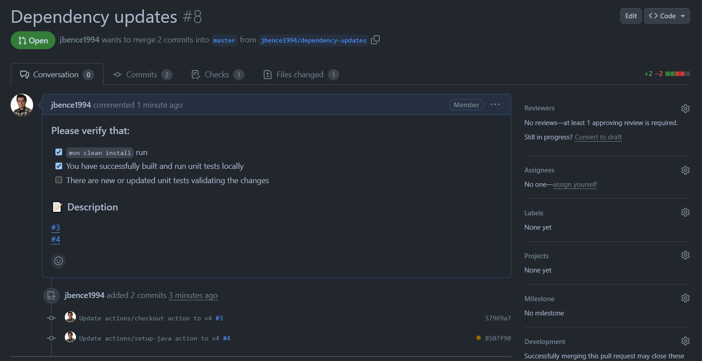

Contributing Guide
==================

Contact
-------

- E-mail: juhasz.bence@netsurfclub.hu

Opening a pull request
----------------------

1. If you are opening a pull request, please use the naming convention pattern for branches below: ```[github-username]/[brief-change-description]```.

2. If you are not ready for code review or just want to run your code on the CI pipeline, please convert your pull request to draft.

3. To merge a pull request are required to pass all the applied CI workflows and get at least one code review with approval.

Updating project dependencies
-----------------------------

1. Create a branch with the following pattern: `[github-username]/dependency-updates`.

2. Collect all the updatable dependency version numbers from the pull requests opened by the `renovate` bot.

3. Update the dependencies, but commit them one-by-one. For each commit message, add the title of updatable dependency's pull request opened by the `renovate` bot.

4. After pushing your changes to GitHub, add the **Dependency updates** title to your pull request. In the pull request description, list the pull request numbers in order that you have included in the dependency updates.

5. After merging your pull request, the `renovate` bot will auto-close all the outdated pull requests. In case it not happening, feel free to close them manually.


